## QuanX 小白配置图文教程：

>**注意：请先认真阅读本节文字**
> 
> 1️⃣ 本教程所使用内容均收集于热心网友分享，原作者请联系我署名，感谢！
> 
> 2️⃣ 首次配置可能需要梯子或者节点，请根据图片步骤一步一步来，如果因为节点的网络问题导致不成功，多试几次！多试几次！多试几次！ 遇到问题请先自己试着解决。
> 
> 3️⃣ 去广告由于网络原因，配置原因并非100%有效，可以尝试清除缓存或者卸载重装。还有部分软件本身毒瘤，可能去不掉。多数软件能去即可，不要钻牛角尖！
> 
> 4️⃣ 有时候功能不完善可能是因为软件版本问题或者开发者没有维护导致。

>**粘贴链接的时候如果报错，请检查一下：**
>>1、链接不能有多余的空格
>>
>>2、报错90%的原因是网络原因，需要自行更换延迟较低的节点，再重新试试。还不行的话，关掉软件，重新试
>>
>>3、认真仔细看图片点的是哪里‼️

## 配置开始
### 1、前往配置文件仓库复制全局配置文件raw路径备用，俗称`小白配置/懒人配置`，此处以[@本仓库](https://github.com/fmz200/wool_scripts/tree/main/QuantumultX)为例。
> **关于配置文件和脚本都在本地/自己手机里的情况，大同小异，我们有时间再说**

#### 1.1 进入本项目的配置文件目录，点击配置文件，如下图，[点击这里直达](https://github.com/fmz200/wool_scripts/tree/main/QuantumultX/config)

#### 1.2 点击raw获取配置文件路径，如下图
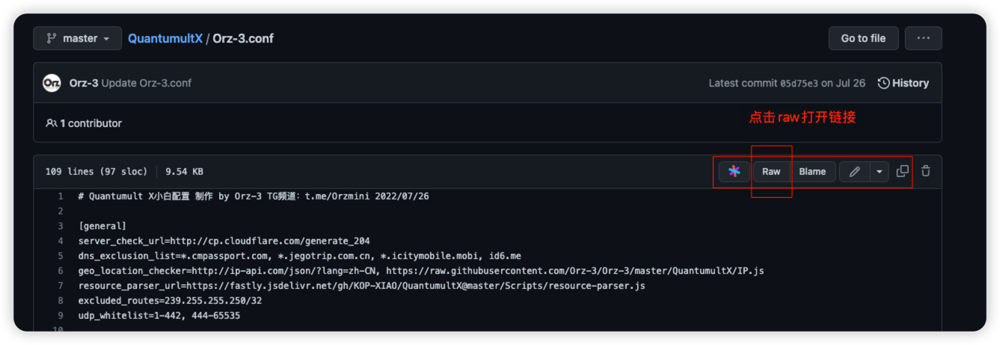

#### 1.3 复制raw地址，如下图，你也可以直接复制 [这个链接](https://raw.githubusercontent.com/fmz200/wool_scripts/main/QuantumultX/config/QuanX.conf)
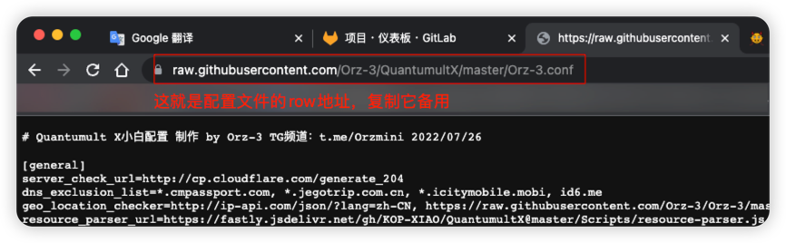

### 2、Quan X主界面，点击`右下角风车`，然后弹出界面下拉至 `配置文件` 区域，点击 `下载配置`，将上一步复制的地址粘贴到弹出窗口，然后点右上角✅确定
> 注意 ⚠️ ：因为该文件是全局配置文件，所以点击确定后会覆盖原有的所有配置！如果不是初次配置请谨慎下载！

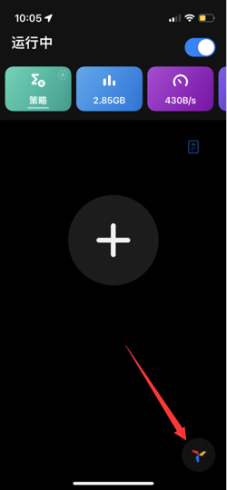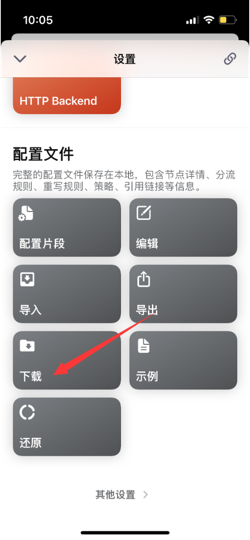
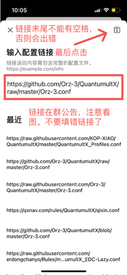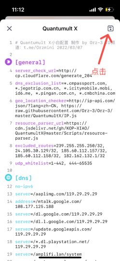

### 3、上一步点击保存后再次点击右下角小风车，往下滑找到`MitM`，点击`生成证书`，继续点击`配置证书`，根据提示`安装证书`
> 你已经看到下面的图片中已经打开了分流，重写和MitM，这是因为已经配置好了，做演示用没有关闭，实际上初次配置是没有打开的，需要配置好证书以后再打开

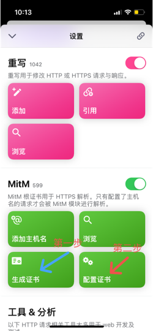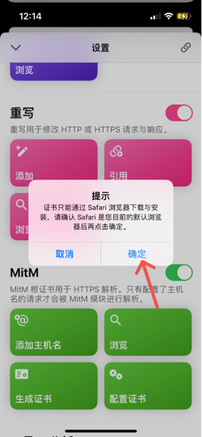

### 4、安装成功后启用证书，并到系统的 **设置 -> 通用 -> 关于本机**，点击`信任证书`，如下图操作即可

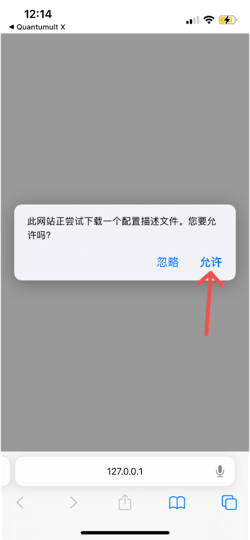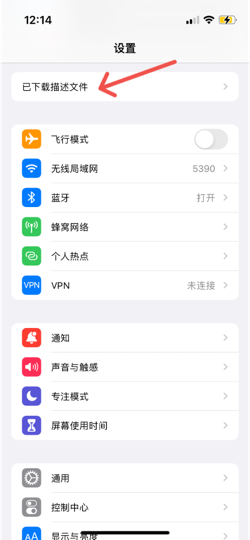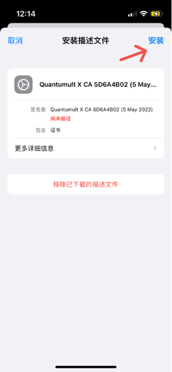

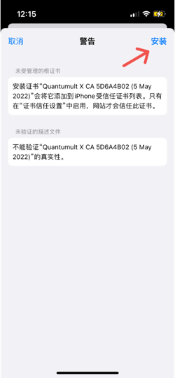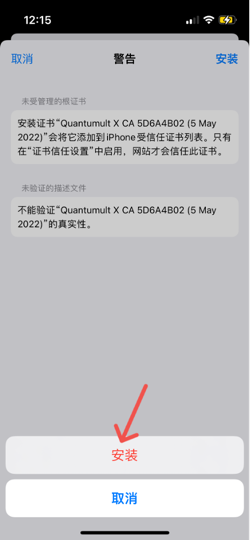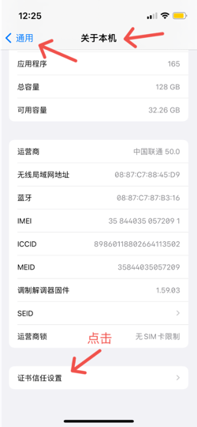

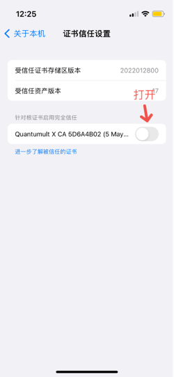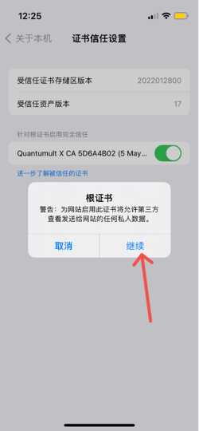

> 到这里证书已经信任以后，**分流，重写，MitM** 就可以打开了

### 5、添加节点 / 订阅，具体为在Quan X主界面点击右下角风车 - 节点 - `节点资源`，然后点右上角添加，填写标签和资源路径（重要，不添加节点重写和分流可能无法更新）

> **这里只说自己买了订阅的情况，关于单个节点添加，大同小异，我们有时间再说**

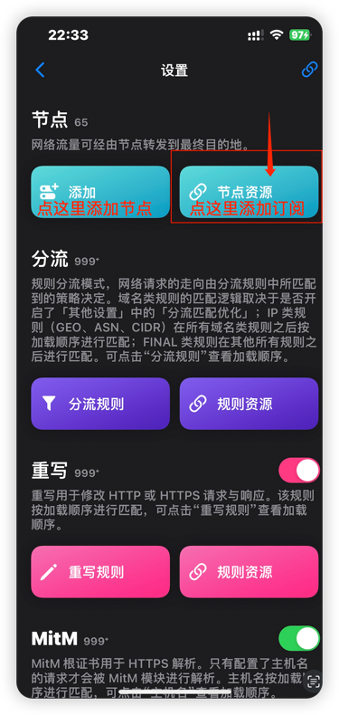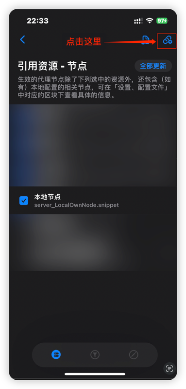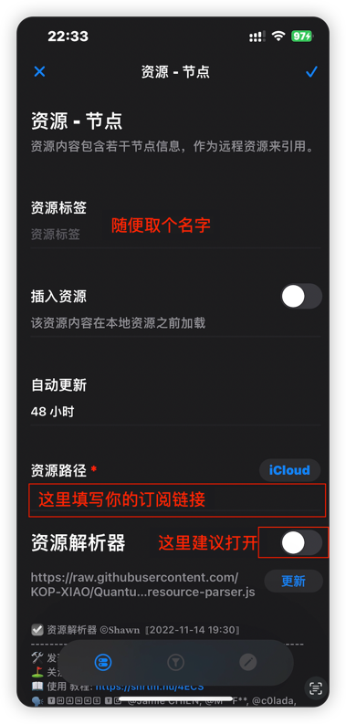

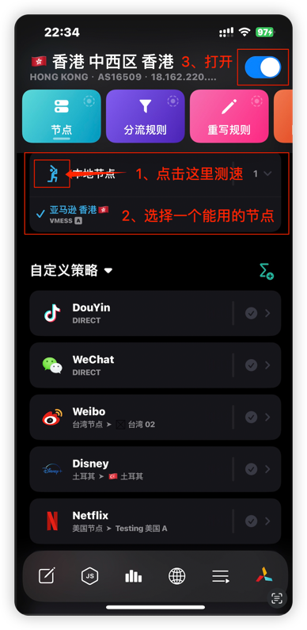

### 6、以上几步弄好以后就配置完毕了，下面更新重写和分流，长按小风车出现以下页面，点击更新按钮🔄，会自动更新全部资源（也就是上面配置文件里面引用的资源），主页面左上角会显示数字表示更新进度。
> 1️⃣ 如果跑完以后没有任何提示就是全部成功，如果有红色的数字提醒就是有失败的，你可以点击红色的数字跳转到具体的失败文件。
> 
> 2️⃣ 如果提示`404`，那就是文件不存在，等待作者更新即可。如果出现`请求超时`，那一般就是网络原因，可以更换节点再试一次。
> 
> 3️⃣ 如果还不知道怎么解决，可以进群交流，[点击这里](https://t.me/lanjieguanggao)加入苹果IOS去广告交流。

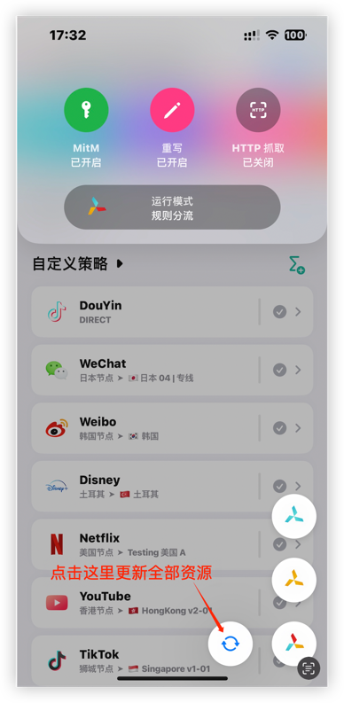

> ✅ 到这里就可以直接使用了，下面的步骤【7、8】都是可选的，如果你没有其他要添加的重写和分流，可以无视。

### 7、添加重写【可选】

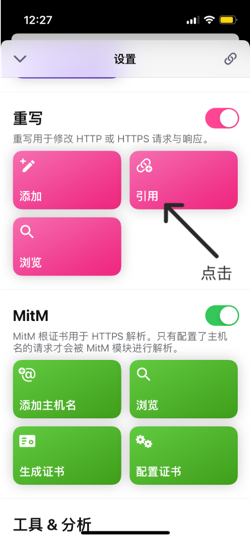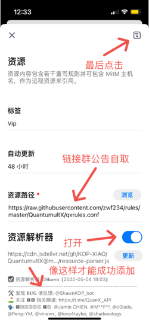

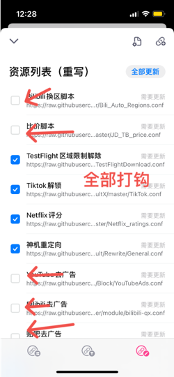

### 8、添加分流【可选】

>**添加分流和重写流程是一样的**
> 
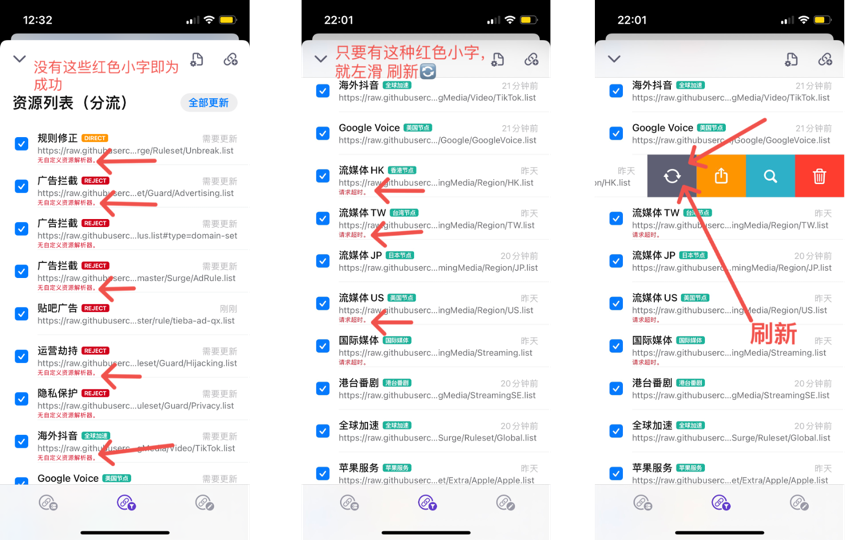

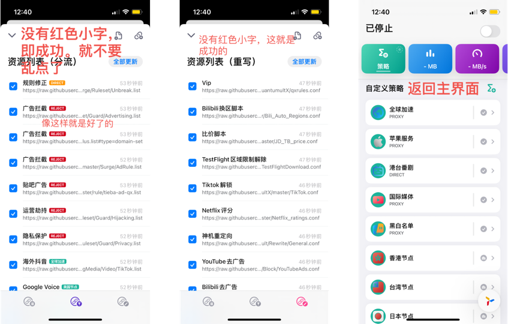

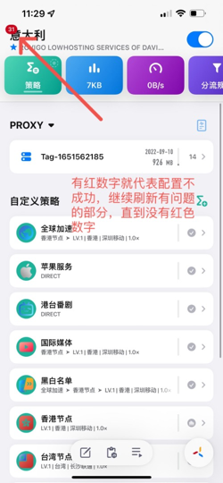

### 9、打开 / 关闭梯子；切换分流模式

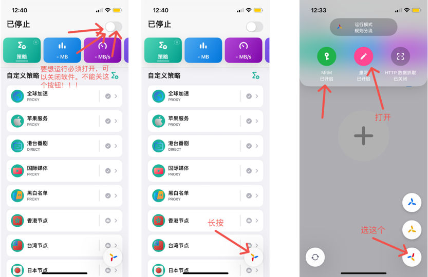

## 配置成功如下图所示，可以正常使用了

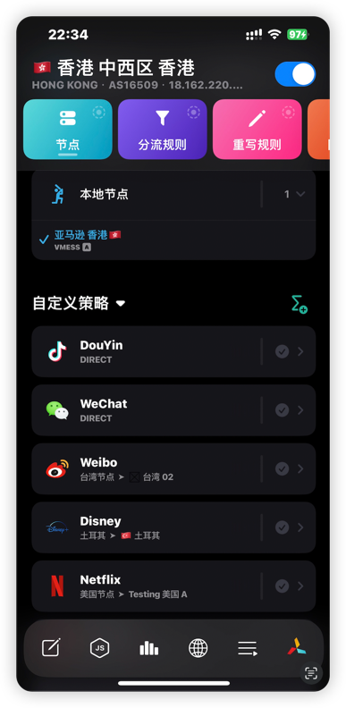