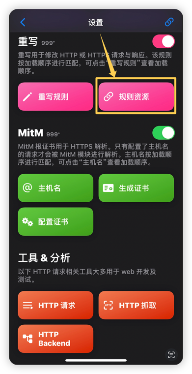
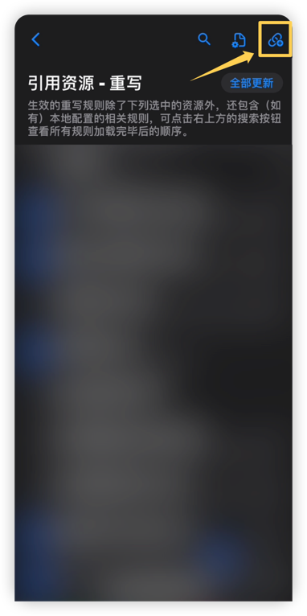
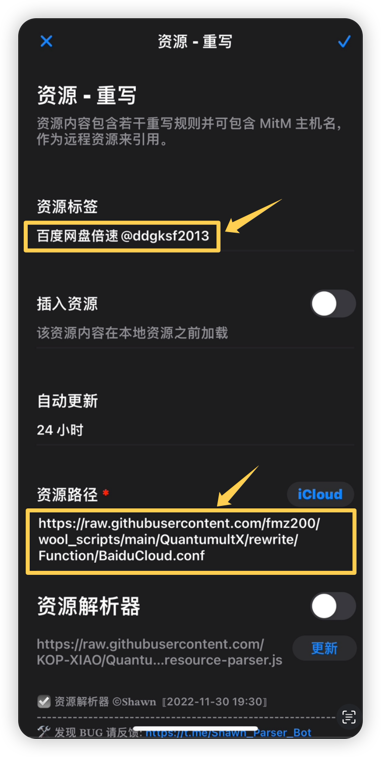
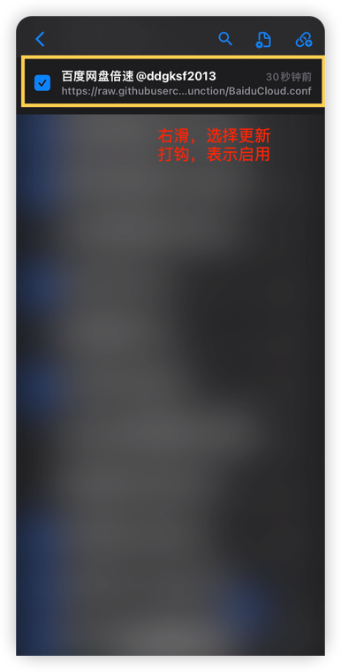
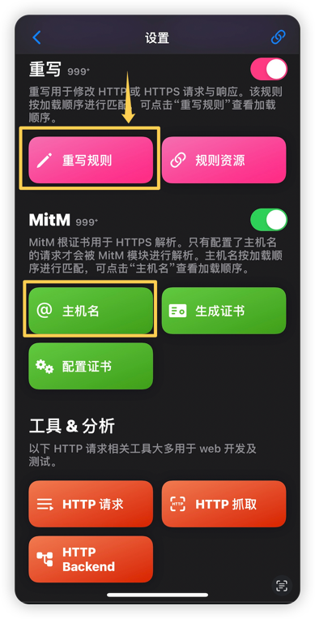
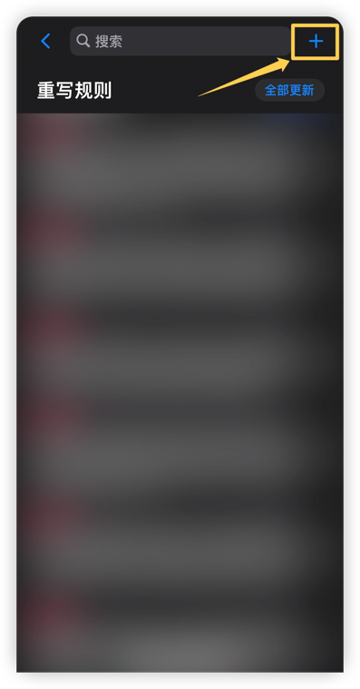
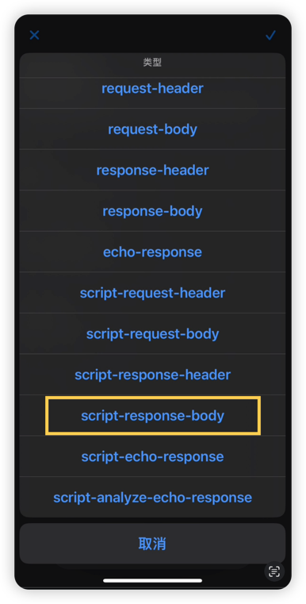
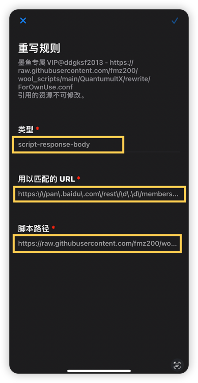
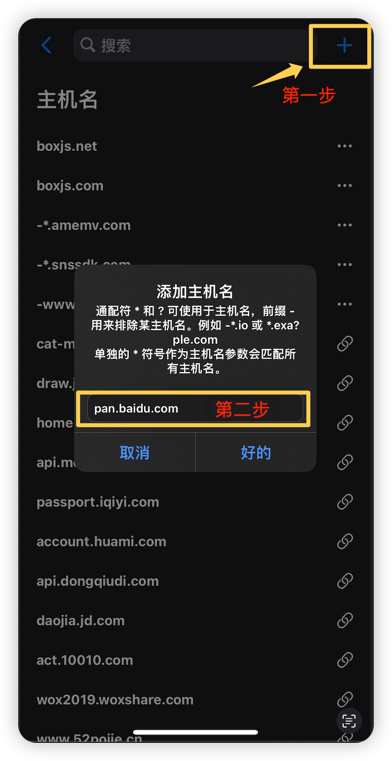

# 怎么添加和使用重写：How to add and use rewrite

> 📣 说明：这部分文档只讨论怎么添加和使用重写，以及主要有几种方式添加重写

## 1️⃣ 什么是重写？
> **rewrite**：又名“修订，修改”，从编程 [eg：Java] 的角度来说，重写的意思是：重写是子类对父类的允许访问的方法的实现过程进行重新编写, 返回值和形参都不能改变。即`外壳保持不变，核心内容重写！`
> 简单来说就是对我们`发出的请求`和`接收到的数据`在不修改数据结构的情况下，修改其具体数据以达到我们的目的。
> 
> ➡️ 举个栗子：
> 
> 假如我们收到一组数据：
>> ```json
>> {"basic":{"token":123},"info":[{"ad":"example.jpg"}],"result":0}
>>```
> 我们可以修改为：
>> ```json
>> {"basic":{"token":123},"info":[],"result":1}
>>```
> 可以看到我们把 **info** 中的内容删除了，同时修改了 **result** 的值，但是 **info** 的数据类型没有变(还是List)，整体的数据结构也没有变，只是对具体的数据进行了修改。
> 
> ❶ 为什么不能修改数据结构？原因是数据都是从服务器返回到APP或者APP发送到服务器的，两者数据的封装有约定的规则，如果一方修改了数据结构，那另一方就无法解析导致报错。就比如电视剧里接头的双方都有对应的暗号，任何一方说错都会对不上号。
> 
> ❷ 数据的修改主要是`修改数值`和`删除部分数据`，比如上方的数据中 `result = 0` 表示“不是会员”，那我们修改成 1 成为会员；info 里存放的是广告数据，那我们把他删除，app就不会则展示广告。
> 为什么不能新增字段数据呢？同 ❶ 中所说，双方是有约定的，多出的数据对方是不认识的。
> 例如上方的数据我们增加一个字段数据成 `{"basic":{"token":123},"info":[],"result":1, "data":9}` ，`"data":9` 对方是不认的。


## 2️⃣ 重写有什么作用？
> 同 1️⃣ 中所说，既然可以修改数据，那部分软件/网站的会员以及广告就有了解锁的方法。所以，重写的作用主要是：解锁软件会员以及去除烦人的广告，这是最常用的。㊗️ 注：这只是其中的部分功能。
> 
> ❶ 为什么是部分软件和网站？因为修改数据需要一个必要的条件：域名必须可以进行MITM(中间人攻击)，只有可以MITM才能获取到app与服务器传输的数据进行修改。例如抖音系列的域名都是无法MITM的，你会发现无法抓包。

## 3️⃣ 怎么添加重写？有哪些方式？
> 打开quanX的设置页面或者配置文件你能看到重写主要有两个地方可以配置： `[rewrite_remote]` 以及 `[rewrite_local]`。

> ❶ 他们的区别是什么？
>> ⒈ 远程复写`[rewrite_remote]`：配置都是别人写好的，包含主机名 hostname 以及复写 rewrite 规则，拿来即用；本地复写`[rewrite_local]`：只有复写 rewrite 规则，hostname 需要自行在 `[hostname]` 模块再添加，相当于把`[rewrite_remote]`文件中的配置复制出来自行配置。
>>
>> ⒉ 对于同一条规则，`[rewrite_local]`优先于`[rewrite_remote]`生效，意思就是`[rewrite_remote]`的配置是多余的不会生效。
>>
>> ⒊ 对于同一条规则，任选一种配置即可，推荐`[rewrite_remote]`。

> ⏩ 话不多说，下面以本库中备份的墨鱼脚本[某度网盘倍速](https://github.com/fmz200/wool_scripts/blob/main/QuantumultX/rewrite/Function/BaiduCloud.conf)为例，讲讲怎么一步一步在quanX中配置。
> 先来看看脚本内容有什么：
> ```
> # > 百度云
> https:\/\/pan\.baidu\.com\/rest\/2\.0\/membership\/user url script-response-body https://raw.githubusercontent.com/fmz200/wool_scripts/main/QuantumultX/scripts/Crack/bdcloud.js
> 
> hostname = pan.baidu.com
> ```
> 配置中去掉注释有两行有效内容：
> ```
> https:\/\/pan\.baidu\.com\/rest\/2\.0\/membership\/user url script-response-body https://raw.githubusercontent.com/fmz200/wool_scripts/main/QuantumultX/scripts/Crack/bdcloud.js
> hostname = pan.baidu.com
> ```
> 第 2 行：hostname表示对哪一个域名进行MITM
> 
> 第 1 行：包含四部分，分别表示：想要MITM的请求路径， url类型， 脚本-对响应-响应体的数据， 用于MITM的脚本路径
> 

### ①  先说 `[rewrite_remote]`

> 第一步：点按首页右下角的小风车，往下滑找到`重写`模块；选择`规则资源`【下图1】；
> 
> 第二步：引用资源页面，点击右上角加👌号➕跳转到填写页面【下图2】；
> 
> 第三步：填写`资源标签`和`资源路径`，标签可以随便写，但是路径必须填写正确，填好以后点击右上角对号✅保存【下图3】；
> 
> 第四步：保存以后找到刚添加的重写，右滑选择更新图标🔄【下图4】。
>> 若不提示任何错误就是更新完毕，若出现404表示资源不存在，等待作者更新；若提示资源无法访问、网络错误等可换个节点在尝试更新。
>> 若不启用，取消勾选即可。
> 
> 第五步：配置完毕，自行测试可用性。



### ②  再说 `[rewrite_local]`
> 上面的配置文件如果你不想直接引用，可以复制其中的内容自行添加，这就是`[rewrite_local]`

> 第一步：点按首页右下角的小风车，往下滑找到`重写`模块；选择`重写规则`【下图1】；
>
> 第二步：重写规则页面，点击右上角加号进行填写，`类型`要保持一致，选择上方配置文件中第一行的`script-response-body`【下图2，3】；
>
> 第三步：`用以匹配的URL`和`脚本路径`都是从上方配置文件中复制出来的，填好以后点击右上角对号✅保存【下图4】；
>
> 第四步：保存以后找到重写模块下方的`MITM`模块，选择`主机名`【下图1】。
> 
> 第五步：主机名页面点击右上角加号，填写上方配置文件中的hostname，点击`好的`保存；
>> 引用的脚本回自动更新，若出现404表示资源不存在，等待作者更新；若提示资源无法访问、网络错误等可换个节点在尝试更新。
>>
>> 你会发现上方配置文件中的所有内容都使用完毕。
>
> 第六步：配置完毕，自行测试可用性。




### 配置完毕

## 4️⃣ 常见问题及解决方式

